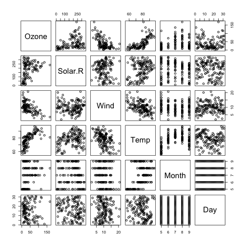

myShinyApp Presentation
========================================================
author: Carlos Castañeda-Orjuela
date: June 21th 2015

Shiny application
========================================================

The programmed shiny application allows to fit linear models in the airquality database. 

The airquality database included daily information about Ozone levels, solar radiation, wind, and temperature from New York City during May to September in 1973.


Summary of the variables included
========================================================


```r
# Load the database
library(datasets)
data(airquality)
summary(airquality)
```

```
     Ozone           Solar.R           Wind             Temp      
 Min.   :  1.00   Min.   :  7.0   Min.   : 1.700   Min.   :56.00  
 1st Qu.: 18.00   1st Qu.:115.8   1st Qu.: 7.400   1st Qu.:72.00  
 Median : 31.50   Median :205.0   Median : 9.700   Median :79.00  
 Mean   : 42.13   Mean   :185.9   Mean   : 9.958   Mean   :77.88  
 3rd Qu.: 63.25   3rd Qu.:258.8   3rd Qu.:11.500   3rd Qu.:85.00  
 Max.   :168.00   Max.   :334.0   Max.   :20.700   Max.   :97.00  
 NA's   :37       NA's   :7                                       
     Month            Day      
 Min.   :5.000   Min.   : 1.0  
 1st Qu.:6.000   1st Qu.: 8.0  
 Median :7.000   Median :16.0  
 Mean   :6.993   Mean   :15.8  
 3rd Qu.:8.000   3rd Qu.:23.0  
 Max.   :9.000   Max.   :31.0  
                               
```

App's goal
=======================================================

Some linear ralitions are evidente in the database. The goal of the app is to fit simple linear models to predict the Temperature or the Solar radiation with variables such as Wind or Ozone levels. 

The Shiny app allows select a pair of variables to fit a lineal model, Shows the plot of two variables with the regression line, and shows the summary of the fitted model. 

 

How works the App?
========================================================

1. Select the dependent (outcome) variable in the radio Bottoms
2. Select the predictor variable
3. Shiny app would show yo the bivariate plot with the regression line
4. A summary of the model is displayed
5. You can change the variables, the app would show the new result immediately

Reach it at: 
<https://ccastanedao.shinyapps.io/courseProject>
